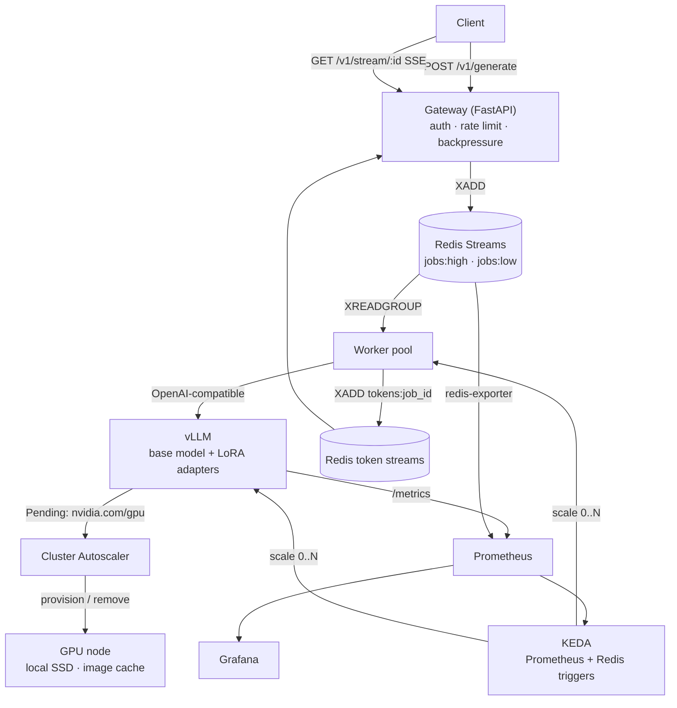

# Ember

**SLO-aware, scale-to-zero LLM inference on Kubernetes**

Ember serves open-weight LLMs on GPUs that turn off when nobody is using them and come back fast when someone is. It scales on what users actually feel (queue wait, time-to-first-token, KV-cache pressure) rather than raw queue length. It attacks cold start with streamed weight loading and local SSD. It reports cost as **dollars per million tokens**, not just latency.

> **Status: in development.** Architecture and experiment plan are defined below. Result tables are placeholders (`—`) until each experiment is run. Every number that appears here will link to the raw run logs that produced it.

---

## Table of contents

- [Why this project](#why-this-project)
- [What Ember adds](#what-ember-adds)
- [Architecture](#architecture)
- [Components](#components)
- [Improvements in detail](#improvements-in-detail)
  - [1. SLO-aware autoscaling](#1-slo-aware-autoscaling)
  - [2. Cold-start reduction](#2-cold-start-reduction)
  - [3. Reliable job delivery](#3-reliable-job-delivery)
  - [4. SSE token streaming](#4-sse-token-streaming)
  - [5. Multi-tenancy: priority, rate limits, backpressure](#5-multi-tenancy-priority-rate-limits-backpressure)
  - [6. Multi-model and multi-LoRA routing](#6-multi-model-and-multi-lora-routing)
  - [7. Cost accounting: $ per 1M tokens](#7-cost-accounting--per-1m-tokens)
- [Experiments and methodology](#experiments-and-methodology)
- [Results](#results)
- [Getting started](#getting-started)
- [API reference](#api-reference)
- [Project structure](#project-structure)
- [Roadmap](#roadmap)
- [Known limitations and non-goals](#known-limitations-and-non-goals)
- [Acknowledgments](#acknowledgments)
- [License](#license)

---

## Why this project

GPUs are expensive and inference traffic is bursty. Keeping a GPU on 24/7 wastes money during idle hours. Turning it off means the first request after a quiet period waits minutes while a GPU node boots and a model loads into VRAM.

Scale-to-zero systems usually solve this with a queue plus an autoscaler watching queue length. That works, but it leaves three problems open:

1. **Queue length is the wrong signal.** A worker removes a job from the queue the moment it starts processing it, so the queue can read zero while the GPU is saturated. It also says nothing about whether users are getting fast responses.
2. **Cold start is treated as fixed.** After image caching, the remaining minutes (node boot plus loading weights into VRAM) are usually declared out of scope.
3. **Cost is asserted, not measured.** "$0/hr when idle" is true but incomplete. The number that matters is what each token costs across realistic traffic, including cold starts and idle warm time.

Ember is built to measure and improve all three.

## What Ember adds

| Area | Common baseline | Ember |
|---|---|---|
| Scaling signal | Redis list length > threshold | Waiting + running requests, KV-cache pressure, and a TTFT SLO target (max of all) |
| Scale-down | Fixed cooldown | Separate cooldowns per tier, plus optional scheduled pre-warming |
| Cold start | Image cache + weights on network disk | Adds streamed weight loading, local SSD, and quantized weights, each measured separately |
| Delivery guarantee | At-most-once (`BRPOP`; job lost if worker dies) | At-least-once (Redis Streams + consumer groups + ack), retries, dead-letter queue |
| Client API | Submit, then poll | Submit, then stream tokens over SSE, with resumable reconnects |
| Tenancy | Single shared queue | API keys, per-tenant rate limits, priority queues, queue-length backpressure |
| Models | One model | Multiple base models and multiple LoRA adapters on one base, with routing |
| Cost reporting | Hourly price | $ per 1M output tokens per configuration, including cold and idle time |

## Architecture



Two planes:

- **Data plane (request path):** client → gateway → Redis Streams → worker → vLLM → token stream → client.
- **Control plane (scaling):** Prometheus collects metrics from vLLM, Redis, and the GPU. KEDA turns them into pod counts. The Cluster Autoscaler turns pending GPU pods into GPU nodes.

## Components

| Component | Tech | Responsibility |
|---|---|---|
| Gateway | FastAPI (async) | Validate input, authenticate, rate-limit, reject under overload, enqueue jobs, stream tokens to clients. Stateless and always on (CPU only). |
| Queue | Redis Streams | Per-priority job streams with consumer groups; per-job token streams; result records with TTL. AOF persistence on a PVC. |
| Worker | Python (asyncio) | Claim jobs, call vLLM with streaming enabled, forward tokens to Redis, ack on completion, retry or dead-letter on failure. |
| Inference engine | vLLM | Continuous batching, paged KV cache, multi-LoRA serving, Prometheus metrics. |
| Pod autoscaler | KEDA | Scale workers and vLLM from 0 to N on multiple triggers. |
| Node autoscaler | Cluster Autoscaler (GKE) | Add a GPU node when a GPU pod is pending; remove it when idle. |
| Metrics | Prometheus, DCGM exporter, redis-exporter, kube-state-metrics | GPU utilization and memory, queue depth, TTFT, KV-cache usage, replica and node counts. |
| Dashboards | Grafana | Latency vs SLO, scaling timeline, cold-start phase breakdown, cost per token. |
| Load generation | Locust + trace replay | Synthetic bursts and replayed daily traffic curves. |
| Cost engine | Python | Joins node lifetime data with token counts to compute $ per 1M tokens. |

---

## Improvements in detail

### 1. SLO-aware autoscaling

**Problem.** Scaling on Redis list length misses in-flight work (the queue reads 0 while the GPU is busy) and says nothing about user-visible latency.

**Service level objectives (initial targets, to be tuned):**

| SLO | Target | Applies to |
|---|---|---|
| Time to first token (TTFT), p95 | ≤ 2 s | Warm system |
| Queue wait, p95 | ≤ 5 s | Warm system |
| Cold-start completion | ≤ 5 min | First request after scale-to-zero |

**Scaling signals.** KEDA is configured with several triggers on the vLLM Deployment. The HPA takes the **maximum** replica count across all triggers, so any one signal can force a scale-up.

| Trigger | Source | Scales up when |
|---|---|---|
| Pending + in-flight demand | `vllm:num_requests_waiting + vllm:num_requests_running` and stream pending count | Demand exceeds per-replica capacity |
| KV-cache pressure | `vllm:kv_cache_usage_perc` | Cache usage stays above ~85%, i.e. the batch cannot grow further |
| TTFT breach | p95 of `vllm:time_to_first_token_seconds` over a short window | p95 exceeds the SLO target |
| Activation | Redis pending count | Any job arrives while at zero replicas |

**Scale-down policy.**
- Workers (cheap, seconds to start): short cooldown.
- vLLM (expensive, minutes to start): longer cooldown, tuned experimentally.
- Optional **scheduled pre-warm**: a KEDA cron trigger holds one replica warm during known busy hours (for example 10:00–20:00 PKT).

**Experiment.** Replay the same traffic trace against (a) queue-length scaling and (b) SLO-aware scaling. Compare p95 TTFT, SLO violation minutes, and $ per 1M tokens.

### 2. Cold-start reduction

**Problem.** Even with a cached container image, a cold start still spends minutes booting the node and loading weights from network-attached disk into VRAM.

Each technique is measured **in isolation first, then combined**, on identical hardware. Every phase gets a timestamp: node request, node ready, pod scheduled, container started, weights loaded, first token served.

| Technique | Idea | Expected effect | Tradeoff |
|---|---|---|---|
| Baseline | Stock vLLM image, weights on PVC (network PD) | Reference | — |
| Image cache | Container layers pre-extracted on a secondary boot disk | Removes image pull time | Disk image must be rebuilt when vLLM changes |
| Streamed weight loading | vLLM's Run:ai Model Streamer load format reads tensors concurrently and streams them to GPU | Faster weight load, especially from object storage | Extra dependency; gain depends on storage bandwidth |
| Local SSD | Weights copied to node-local NVMe instead of network disk | Higher read bandwidth during load | Local SSD is wiped with the node, so weights must be re-staged each boot |
| Quantized weights | AWQ 4-bit version of the same model | Fewer bytes to read and move into VRAM | Possible quality loss; must be measured on an eval set |
| Combined | Best-performing stack | Lowest total cold start | Most moving parts |

**Quality guardrail.** Quantized variants are scored against the full-precision model on a fixed evaluation prompt set. A speedup that breaks answer quality is reported as a failure.

### 3. Reliable job delivery

**Problem.** With `BRPOP`, a job is deleted from Redis the moment a worker takes it. If the worker dies (Spot preemption, OOM kill), the job is lost and the client waits forever.

**Design.**
- Jobs are appended with `XADD` to Redis Streams and claimed with `XREADGROUP` by a consumer group.
- A claimed job stays in the stream's pending list until the worker sends `XACK` after writing the result.
- `XAUTOCLAIM` reassigns any job left unacknowledged longer than a timeout to a healthy worker.
- Each job carries an attempt counter. After 3 failures it moves to `jobs:dead` and the client receives `status: failed` with a reason.
- Result writes are idempotent, so duplicate processing is harmless.
- Redis runs with AOF persistence on a PersistentVolume so a Redis restart does not erase the queue.

**Delivery guarantee:** at-least-once, with idempotent results.

**Experiment.** Kill workers and preempt the GPU node mid-run under load. Count lost jobs (target: 0) and duplicated jobs.

### 4. SSE token streaming

**Problem.** Polling adds latency, wastes requests, and returns the whole answer at once.

**Design.**
- `POST /v1/generate` still returns a `job_id` immediately, which keeps queue safety during cold start.
- `GET /v1/stream/{job_id}` opens a Server-Sent Events connection:
  - While queued or cold-starting, it sends periodic status events (`queued`, `warming_up`, estimated wait). These also act as keep-alives so proxies do not close the connection.
  - Once generation starts, it sends one event per token.
- The worker appends each token to a per-job Redis stream (`tokens:{job_id}`). A client that disconnects reconnects with the standard `Last-Event-ID` header and resumes from the last token it received.
- `GET /v1/result/{job_id}` remains for clients that prefer polling.

### 5. Multi-tenancy: priority, rate limits, backpressure

**Design.**
- **API keys.** Every request is authenticated; each key maps to a tenant and a tier.
- **Rate limits.** Token-bucket limits per tenant, stored in Redis (requests per minute and output tokens per minute).
- **Priority queues.** Separate streams per tier (`jobs:high`, `jobs:low`). Workers use weighted draining so high priority is served first but low priority is never starved.
- **Backpressure.** The gateway estimates wait time from current backlog and measured throughput. If a new job cannot finish within its tier's deadline, the gateway returns `429` or `503` with `Retry-After` instead of accepting work it will not complete in time.
- **Input limits.** Maximum prompt length and maximum output tokens per tier.

**Experiment.** Flood the system from one low-priority tenant while a high-priority tenant sends steady traffic. Measure whether the high-priority tenant stays within SLO.

### 6. Multi-model and multi-LoRA routing

**Design.**
- **Multi-LoRA.** One vLLM instance serves a base model plus several LoRA adapters. The request's `model` field selects the adapter. Many fine-tuned variants share one GPU instead of one GPU each.
- **Multi-model.** Different base models run as separate vLLM Deployments, each with its own KEDA ScaledObject, so an unused model scales to zero independently.
- **Routing.** The gateway maps the requested model to its stream, and workers are pinned per base model.

**Experiment.** Compare cost and latency for N fine-tuned variants served as (a) N separate base-model deployments versus (b) one base model with N LoRA adapters.

### 7. Cost accounting: $ per 1M tokens

**Problem.** An hourly GPU price does not tell you what serving actually costs, because it ignores idle warm time, cold starts, and how fully the GPU is used.

**Method.** For each experiment run:

```
total_cost = Σ (node_lifetime_hours × node_hourly_price)
           + control_plane_hours × control_plane_price

$ per 1M output tokens = total_cost / output_tokens × 1,000,000
```

- Node lifetimes come from Cluster Autoscaler and kube-state-metrics events, so cold-start time and cooldown time are billed, just like in real life.
- Token counts come from vLLM's `vllm:generation_tokens_total`.
- Spot and on-demand prices are recorded with the date of the run, since prices change.

This turns every design decision (cooldown length, pre-warming, quantization, LoRA vs separate models) into one comparable number.

---

## Experiments and methodology

All experiments run on the same hardware unless stated otherwise: GKE, one NVIDIA T4 Spot node pool (0–N nodes), model `Qwen/Qwen2.5-1.5B-Instruct` (and its AWQ variant for quantization runs).

**Traffic patterns.**
- **Burst:** idle, then a sudden burst of requests (tests cold start).
- **Steady:** constant request rate (tests warm throughput).
- **Daily trace:** a compressed 24-hour curve with a daytime peak (tests cooldown and pre-warming decisions).

**Recorded for every run:** p50/p95/p99 TTFT, queue wait, end-to-end latency, tokens/sec, GPU utilization, KV-cache usage, replica and node counts over time, cold-start phase timings, lost and duplicated jobs, and $ per 1M tokens.

**Reproducibility.** Each run writes a timestamped directory of raw logs and metrics snapshots. Every result table below links to the run ID that produced it. Each configuration is run at least 3 times and reported as a median with range.

## Results

> Placeholders until experiments are run. No number will be filled in without a linked run.

### Cold start by technique

| Configuration | Node boot | Image ready | Weights → VRAM | First token | Total | vs baseline |
|---|---|---|---|---|---|---|
| Baseline (PVC) | — | — | — | — | — | — |
| + image cache | — | — | — | — | — | — |
| + streamed loading | — | — | — | — | — | — |
| + local SSD | — | — | — | — | — | — |
| + AWQ quantization | — | — | — | — | — | — |
| Combined | — | — | — | — | — | — |

### Scaling policy comparison (daily trace)

| Policy | p95 TTFT | SLO violation minutes | GPU hours | $ per 1M tokens |
|---|---|---|---|---|
| Queue length > 5 | — | — | — | — |
| SLO-aware (multi-trigger) | — | — | — | — |
| SLO-aware + scheduled pre-warm | — | — | — | — |

### Cooldown sweep

| vLLM cooldown | Cold starts triggered | p95 end-to-end latency | $ per 1M tokens |
|---|---|---|---|
| 2 min | — | — | — |
| 5 min | — | — | — |
| 15 min | — | — | — |
| 30 min | — | — | — |

### Reliability under failure

| Scenario | Jobs sent | Lost | Duplicated | Recovery time |
|---|---|---|---|---|
| Worker killed mid-job | — | — | — | — |
| Spot node preempted | — | — | — | — |
| Redis pod restarted | — | — | — | — |

### LoRA vs separate deployments

| Setup | Variants | GPUs needed | p95 TTFT | $ per 1M tokens |
|---|---|---|---|---|
| Separate base models | — | — | — | — |
| One base + LoRA adapters | — | — | — | — |

---

## Getting started

### Prerequisites

- Python 3.12+
- Docker
- kubectl, helm, k3d (local)
- `gcloud` CLI and a GCP project with GPU quota (cloud)
- NVIDIA GPU with drivers (only if running vLLM locally)

### Phase 1: local, no GPU

Runs the full request path with a mock model that simulates token generation. This validates the gateway, queue, streaming, retries, and KEDA scaling without spending anything.

```bash
cp .env.example .env
./scripts/deploy-local.sh          # k3d cluster + Redis + KEDA + gateway + worker + mock model
python loadtest/burst.py --host http://localhost:8080
./scripts/destroy-local.sh
```

### Phase 2: cloud (GKE, T4 Spot)

```bash
./scripts/deploy-gcp.sh            # cluster, GPU node pool (min 0), images, manifests
./scripts/build-node-cache.sh      # optional: image cache disk
./scripts/run-experiment.sh cold-start --config configs/baseline.yaml
./scripts/destroy-gcp.sh           # always tear down after a session
```

> **Cost warning.** A GKE control plane plus a T4 Spot node costs money every hour they exist. Run `destroy-gcp.sh` after every session and set a billing budget alert.

## API reference

| Method | Endpoint | Description |
|---|---|---|
| `POST` | `/v1/generate` | Enqueue a prompt. Returns `job_id` immediately. Requires `Authorization: Bearer <api_key>`. Optional `Idempotency-Key` header. |
| `GET` | `/v1/stream/{job_id}` | SSE stream: status events while queued, then tokens. Supports `Last-Event-ID` to resume. |
| `GET` | `/v1/result/{job_id}` | Poll for the final result: `queued`, `running`, `done`, or `failed`. |
| `GET` | `/v1/models` | List available base models and LoRA adapters. |
| `GET` | `/health` | Liveness check. |

**Request body (`/v1/generate`):**

```json
{
  "model": "qwen2.5-1.5b/support-bot-lora",
  "prompt": "Explain autoscaling in one paragraph.",
  "max_tokens": 256
}
```

**Error responses:** `401` invalid key, `413` prompt too long, `429` tenant rate limit exceeded, `503` system overloaded (with `Retry-After`).

## Project structure

```
ember/
├── gateway/              # FastAPI: auth, rate limiting, backpressure, SSE
├── worker/               # Stream consumer: vLLM client, token forwarding, ack/retry/DLQ
├── mock-model/           # CPU-only fake vLLM for local development
├── k8s/
│   ├── base/             # Deployments, Services, Redis, ConfigMaps
│   ├── keda/             # ScaledObjects: queue, SLO-aware, cron pre-warm
│   └── gcp/              # GPU node pool, local SSD, image cache
├── monitoring/           # Prometheus rules, Grafana dashboards, exporters
├── loadtest/             # Burst, steady, and trace-replay generators
├── experiments/
│   ├── configs/          # One YAML per experiment configuration
│   └── analysis/         # Notebooks and scripts that produce result tables
├── cost/                 # $ per 1M tokens calculator
├── scripts/              # Deploy, destroy, run-experiment, full-cycle
├── docs/
│   ├── design-doc.md     # Decisions, alternatives considered, tradeoffs
│   └── experiment-log.md # Every run, including the ones that failed
└── data/                 # Raw run output (gitignored)
```

## Roadmap

- [x] **M1. Async core:** gateway + Redis Streams + worker + mock model (Docker Compose)
- [ ] **M2. Reliability:** ack, retry, dead-letter queue, AOF persistence, failure-injection tests
- [ ] **M3. Streaming:** SSE endpoint with resumable reconnects
- [ ] **M4. Kubernetes + KEDA:** local k3d, scale workers 0 → N
- [ ] **M5. GPU + vLLM on GKE:** real model, Cluster Autoscaler, baseline measurements
- [ ] **M6. SLO-aware scaling:** Prometheus triggers, policy comparison, cooldown sweep
- [ ] **M7. Cold-start experiments:** streamed loading, local SSD, AWQ, combined
- [ ] **M8. Multi-tenancy:** API keys, rate limits, priority queues, backpressure
- [ ] **M9. Multi-model / multi-LoRA:** routing and LoRA vs separate-deployment study
- [ ] **M10. Cost engine and write-up:** $ per 1M tokens for every configuration

## Known limitations and non-goals

- **Single Redis instance.** Redis is a single point of failure. Production would use Redis Sentinel or a managed service. Out of scope here, stated deliberately.
- **Single region, single GPU type.** All results are from T4 Spot in one zone and may not transfer to other GPUs.
- **Small model.** A 1.5B model keeps experiments cheap. Load-time and batching results will differ for 7B+ models.
- **Spot preemption.** Spot nodes can be reclaimed at any time. This is used as a real failure-injection source, but it also adds variance to timings.
- **No multi-GPU or tensor parallelism.** Every model fits on one GPU.

## Acknowledgments

The baseline architecture (queue-buffered gateway, KEDA pod scaling, Cluster Autoscaler node scaling, image-cache cold-start optimization) was inspired by [adityonugrohoid/gpu-autoscale-inference](https://github.com/adityonugrohoid/gpu-autoscale-inference) (MIT License). Ember is an independent implementation. Its scaling policy, reliability layer, streaming, multi-tenancy, multi-LoRA routing, cold-start experiments, and cost engine are new work.

Built on [vLLM](https://github.com/vllm-project/vllm), [KEDA](https://keda.sh), [Kubernetes Cluster Autoscaler](https://github.com/kubernetes/autoscaler), [Redis](https://redis.io), and [FastAPI](https://fastapi.tiangolo.com).

## License

MIT

## Author

**Muhammad Obaidullah**
